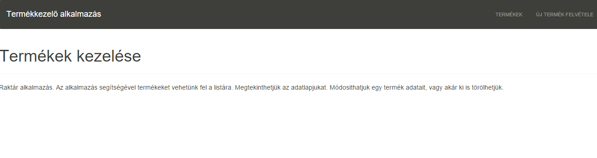

#Giligor Dávid
#HSYGGS
#Alkalmazások fejlesztése harmadik beadandó - Raktár kezelő
##2016.01.17

###Követelményanalízis

Egy webes vastagkliens, azaz egyoldalas alkalmazás készítése Ember.js segítségével az utolsó beadandó. Feladatot illetően lehet a szerveroldali alkalmazásnak egy kliensoldali változata, de másik feladat is választható. A feladatnak mininálisan tartalmaznia kell:

* legalább két modellt, egy-sok kapcsolatban
* legalább 1 űrlapot
* legalább 1 listázó oldalt
* legyen lehetőség új felvételére
* legyen lehetőség meglévő szerkesztésére
* legyen lehetőség meglévő törlésére
* REST API végpont kialakítása
* szerveroldali perzisztálás fájlba
A formai követelményeknek megfelelően kell elkészíteni, dokumentálni és közzétenni. Az órai gyakorlatnak megfelelően ez új workspace-ek létrehozását jelenti Cloud9 oldalon, és a Github-on is külön kódtárba dolgozzunk. A dokumentációval kapcsolatos elvárások a formai követelményeknél írtaknak megfelelő (minden kell). A Heroku-n való közzététel opcionális.

A feladatötletek közül a Raktár kezelő alaklmazást választottam.

###Tervezés
##Osztálymodell

##Felhasználói felület modell

##Oldaltérkép

* Főoldal(Termékkezelő alkalmazás)
 * -Termékek
 * -Új termék felvétele
  
##Végpontok

###Futattás

Githubról le kell tölteni a projektet, majd a cloud9 ide segítsévégel elindítani (támogatja a rest_api-t és az ember.js-t).
Kettő workspacet létrehozunk egyet a szervernek egyet pedig a projectnek, elindítjuk a server.js-t, majd a projecten belül ./node_modules/.bin/ember serve paranccsal szolgáljuk ki.
A projectből a dist mappát kitéve el tudjuk indítani a projectet bármely szerverről.

###Adatmodell

* Hozzáadás dátuma
* Megnevezés
* Időpont

###Használati útmutató

A termékek menüpont alatt érhetjük a meglévő termékeket, illetve vehetünk fel újakat. A megtekint gombbal tekinthetjük meg az adott feladatot, és a töröl gombbal törölhetjük is azt.

Új termék felvétele: A leirást egy legördülő menü segítségével választhatjuk ki. 
Megtekint: Az adott feladatról egy részletes leírást kapunk.
Töröl: A töröl gombbal tudjuk törölni a feladatot.

###Szerepkörök

Egyetlen szerepkör van, mégpedig a látogató ő hozzá fér mindenhez.

###Mappaszerkezet

* README.md
* app/
* bower.json
* bower_components/
* config/
* dist/
* ember-cli-build.js
* node_modules/
* package.json
* public/
* testem.json
* tests/
* tmp/
* vendor/
* 

